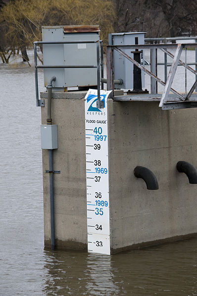

# executor-exporter
[](https://codecov.io/gh/ygormutti/executor-exporter)
[](https://github.com/ygormutti/executor-exporter/actions/workflows/main.yml)

A [Prometheus](https://prometheus.io/) metrics exporter for Python [`concurrent.futures`](https://docs.python.org/3/library/concurrent.futures.html) executors. Provides instrumented drop-in replacements for `ThreadedPoolExecutor` and `ProcessPoolExecutor`.



*Public domain photo by Patsy Lynch. [More info](https://commons.wikimedia.org/wiki/File:FEMA_-_40847_-_A_water_level_ruler_in_North_Dakota.jpg)*

## Install it from PyPI

```bash
pip install executor-exporter
```

## Usage

```py
from executor_exporter import ThreadPoolExecutor
# or
from executor_exporter import ProcessPoolExecutor
```

If you stick to the public APIs of `concurrent.future` executors (consisting of `__init__`, `submit`, `map` and `shutdown` methods), you just need to replace the builtin executor with its instrumented version provided by this package.

The provided executors act as [proxies](https://en.wikipedia.org/wiki/Proxy_pattern) for the builtin executor while collecting the following metrics:

<!-- metrics:begin -->
Name | Type | Labels | Description
--- | --- | --- | ---
python_executor_max_workers | counter | executor, executor_type | Max workers accumulated by executor, i.e. instances with same executor_id
python_executor_initialized_workers | counter | executor, executor_type | Number of workers initialized by the executor
python_executor_submitted_tasks | counter | executor, executor_type | Number of tasks submitted to the executor
python_executor_task_wait_seconds | histogram | executor, executor_type | Time elapsed between tasks submission and start
python_executor_running_tasks_total | gauge | executor, executor_type | Number of started tasks not yet done
python_executor_tasks_duration_seconds | histogram | executor, executor_type, result | Duration of tasks done by the executor, segmented by result (completed or failed)
<!-- metrics:end -->

The `__init__` methods of the instrumented executors take an additional `exporter_id : Optional[str]` parameter, used as the value for `exporter` metric label. If your use multiple executor instances of the same type you can measure them separately by defining a unique id for each instance. Conversely, by using the same id across multiple instances their metrics will be combined and exported as if they came from a single instance.

### Custom executors

The instrumented executors are just wrappers around the builtin executors provided for convenience, while `InstrumentedExecutorProxy` does the heavy-lifting. If you're using a custom executor, you can wrap it like this:

```py
from executor_exporter import InstrumentedExecutorProxy, ExecutorExporter

max_workers = 42
executor = YourCustomExecutor(max_workers)
exporter = ExecutorExporter(executor)

instrumented_executor = InstrumentedExecutorProxy(executor, exporter, max_workers)
```

## TODO

- [ ] Testing
- [ ] Housekeeping
  - [ ] Makefile
- [ ] CI/CD
- [ ] codecov